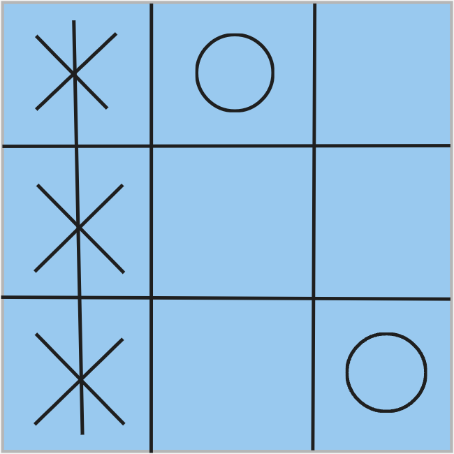

<!-- PROJECT LOGO -->
<br />
<p align="center">
  <a href="https://github.com/Oli7000/Tic-Tac-Toe-in-JS.git">
    
  </a>

  <h3 align="center">The Tic-Tac-Toe Game made with JavaScript</h3>

  <p align="center">
    Here I'll explain about what this project is and how you set it up!
    <br />
    <a href="https://github.com/Oli7000/Tic-Tac-Toe-in-JS/blob/main/README.md"><strong>Explore the docs »</strong></a>
    <br />
    <br />
    <a href="https://github.com/Oli7000/Tic-Tac-Toe-in-JS.git">View Demo</a>
    ·
    <a href="https://github.com/Oli7000/Tic-Tac-Toe-in-JS.git/issues">Report Bug</a>
    ·
    <a href="https://github.com/Oli7000/Tic-Tac-Toe-in-JS.git/issues">Request Feature</a>
  </p>
</p>

<!-- TABLE OF CONTENTS -->
<details open="open">
  <summary>Table of Contents</summary>
  <ol>
    <li>
      <a href="#about-the-project">About The Project</a>
    </li>
    <li>
      <a href="#installation-guide">Installation Guide</a>
    </li>
  </ol>
</details>

<!-- ABOUT THE PROJECT -->
## About The Project

This project was a project from the school. Before having the exam for JavaScript you had the possibility to make some exercise, so you can earn points which will be added to the points you will achive on the exam. For this you could do some exercises for the maximum points of two. As the Tic-Tac-Toe exercises gave directly the points of two, I decided to do this exercise.

For me the exercise wasn't simple at all, because during this time I didn't code a lot in JavaScript. So I first looked on the internet for a good tutorial about how to do is.
I looked up the code from the website [Geeksforgeeks](https://www.geeksforgeeks.org/simple-tic-tac-toe-game-using-javascript/) But I changed the code a lot, because the code wasn't so clean for me. So I cleaned it up😂. And since the project didn't satisfy me enough, I added a lot of nice stuff in it like points stand or when this person wins, then a altert comes and you can decide if you want to replay or stop.

<!-- INSTALLATION -->
## Installation Guide

1. At first you need to install git on your local computer. For that you need to go to this [website](https://git-scm.com/downloads).
2. Go to your windows explorer and search for a good place for storing this project
3. Now right click on your folder or place and then click on "Git Bash Here"
4. Finally you will see a new program. If you do you only have to enter this
   ```sh
   git clone https://github.com/Oli7000/GGames.git
   ```
